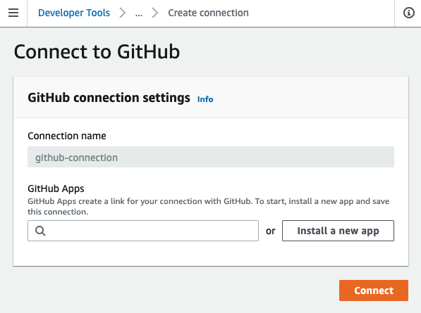

# Github version

This alternate version of the stack uses a *GitHub* repo as source instead of AWS CodeCommit. This makes use of [AWS CodePipline GitHub connections](https://docs.aws.amazon.com/codepipeline/latest/userguide/connections-github.html).

The walk though instructions are broadly the same as for the CodeCommit version, with a few differences as summarized below.

## Installing Terraform

This code sample requires Terraform 1.0.2 or higher.

To install Terraform:
```
wget https://releases.hashicorp.com/terraform/1.0.2/terraform_1.0.2_linux_amd64.zip
unzip terraform_1.0.2_linux_amd64.zip
sudo mv terraform /usr/local/bin/
export PATH=$PATH:/usr/local/bin/terraform
```

## Edit terraform variables

The Terraform stack assumes that a *GitHub* repo has already been created.

Edit `terraform.tfvars` and on the line

```
source_repo_id="<insert your repo id here>"
```

replace the value with your full repo id. For example, if your github account is "joebloggs" and your repo name is "test", then use "joebloggs/test".

Also, don't forget to set `aws_region` to the correct region.


## Post-build step: Installing CodeStar connection for GitHub

On completion of the Terraform stack build, the GitHub connection status will be `PENDING` . You can verify this using:

```
aws codestar-connections list-connections 
```

You should see:
```
{
    "Connections": [

        {
            "ConnectionArn": "arn:aws:codestar-connections:us-east-1:845041152230:connection/225edaf8-afc4-45e4-8c8e-11ee71d48e9f", 
            "ProviderType": "GitHub", 
            "OwnerAccountId": "845041152230", 
            "ConnectionStatus": "PENDING", 
            "ConnectionName": "github-connection"
        }
    ]
}
```

To fix this, open the [developer tools connection console ](https://console.aws.amazon.com/codesuite/settings/connections), and select the pending `github-connection`.

Click `Update pending connection`, sign in to GitHub and complete the github authorization for the connection.


You should then see:



Click `Install a new app`, and follow the Github onscreen instructions.

Once back in the AWS connection dialog click `Connect`.

Verify the status has changed to `AVAILABLE` using:

```
aws codestar-connections list-connections 
```


At this point, if you retry the pipline you should see the error:
```
Action execution failed
[GitHub] No Branch [master] found for FullRepositoryName
```
This will be fixed once you push the application code.

## Set up a local git repo for the petclinic application

After doing a `git init` in the application folder, you will need to set up your GitHub repo as a remote. You can do this using:

```
git remote add origin https://github.com/<github-user>/<repo-id>.git
```

After you push your code you should eventually see the following in the AWS CodePipeline console.


